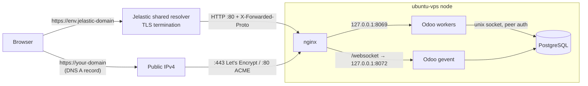

# Odoo Single Node for Jelastic

Install **Odoo Community 17, 18, 19 or 20** on **one** Jelastic node with a single import:
Ubuntu 24.04, PostgreSQL, nginx and Let's Encrypt, with backups, updates and upgrades
driven from buttons in the dashboard.

It replaces the three-node layout of the marketplace package (nginx balancer + Odoo +
PostgreSQL) with one node that is cheaper, simpler to maintain and does not lose data
on redeploy.

- [Quick start](#quick-start)
- [Why a single node](#why-a-single-node)
- [What gets installed](#what-gets-installed)
- [Day-to-day operations](#day-to-day-operations)
- [Architecture](#architecture)
- [Security](#security)
- [Performance](#performance)
- [Upgrades](#upgrades)
- [Backups and restore](#backups-and-restore)
- [Customising](#customising)
- [Troubleshooting](#troubleshooting)
- [Limits](#limits)
- [Repository layout](#repository-layout)
- [Development and tests](#development-and-tests)

---

## Quick start

1. Jelastic dashboard → **Import** → **URL**, paste:

   ```
   https://raw.githubusercontent.com/gfrino/odoo-single-node-jelastic/main/manifest.jps
   ```

2. Pick the **Odoo version**, the **admin e-mail** (it becomes the login), the
   **language**, and keep **Public IPv4** on if you will use your own domain.
3. Wait a few minutes (the Odoo package alone is ~330 MB). The success message shows
   the URL and the **admin password**.
4. Your own domain: create a DNS **A record** pointing to the node's public IP, then
   on the Odoo node open **Add-Ons → Odoo Manager → Add domain**.

The environment is reachable right away at `https://<env>.<jelastic-domain>` through
Jelastic's own SSL.

## Why a single node

| | Marketplace package | This package |
|---|---|---|
| Nodes | 3 (nginx, Odoo, PostgreSQL) | **1** |
| OS | Different images per node | Ubuntu 24.04 everywhere |
| PostgreSQL | Separate node, reachable on the internal network, Odoo user created as `SUPERUSER` | Same node, **no TCP port**, Odoo user without superuser rights |
| SSL | Jelastic hooks edit `ssl.conf` in place (sections duplicated on renewals) | nginx config generated from scratch every time; certbot renews on its own |
| Redeploy | Odoo image tag moves (`odoo:20.0` = whatever is newest) | Same pinned Odoo build is reinstalled; data on volumes |
| PostgreSQL major upgrade | Manual dump/restore | One button (`pg_upgradecluster`) |
| Odoo build updates | Redeploy to a moving tag, no rollback | One button, backup first, automatic rollback |

## What gets installed

| Component | Source | Version policy |
|---|---|---|
| Ubuntu | Jelastic `ubuntu-vps` template | 24.04 or later (the installer stops on older releases) |
| Odoo | Official `.deb` from [nightly.odoo.com](https://nightly.odoo.com), **stable** branch: the same package the official Docker image is built from | Pinned to the build installed; changes only via **Update Odoo** |
| PostgreSQL | Official [PGDG](https://www.postgresql.org/download/linux/ubuntu/) repository | Newest major at install time (18 today); minor releases automatic |
| nginx, certbot | Ubuntu | Security updates automatic |
| wkhtmltopdf | 0.12.6.1-3 patched-Qt build (the one the official Odoo images use), checksum verified | Held |

Supported Odoo versions: **17.0, 18.0, 19.0, 20.0**. Odoo 16 does not run on Ubuntu
24.04 (Python 3.12) and is not offered.

## Day-to-day operations

Everything is on the node: **Add-Ons → Odoo Manager**.

| Button | What it does |
|---|---|
| **Status** | OS, Odoo, PostgreSQL and nginx versions and state, database and filestore size, workers, domains, certificate expiry, last backup, disk use |
| **Add domain** | Checks that each domain's DNS points to this node, issues (or extends) one Let's Encrypt certificate for all custom domains, enables them in nginx, sets `web.base.url` |
| **Remove domain** | Reissues the certificate without those domains (or deletes it if none are left) |
| **Renew SSL now** | Forces a renewal. Normally not needed: certbot checks twice a day |
| **Backup now** | Database dump + filestore into `/var/backups/odoo` |
| **List backups** | Backup files and free space |
| **Restore backup** | Restores a backup; the current database is kept aside until the restore has succeeded |
| **Update Odoo** | Installs a newer build of the **same** major version (`latest` or `YYYYMMDD`), optionally with `-u all`. Backup first, automatic rollback if Odoo does not answer afterwards |
| **Upgrade PostgreSQL** | Major upgrade with `pg_upgradecluster`. Dump first; the old cluster is kept stopped unless you tick "remove" |
| **Update scripts** | Downloads the latest version of these scripts from GitHub |

The same scripts can be run over SSH as root, e.g. `/opt/odoo/jps/status.sh`. Every
script documents its options at the top, and all of them log to
`/var/log/odoo-jps.log`.

## Architecture



### Everything that matters is on a volume

A Jelastic redeploy replaces the OS image and keeps the volumes. After a redeploy,
`install.sh` runs again, reinstalls the **same** Odoo build (kept in `/opt/odoo/debs`)
and the **same** PostgreSQL major, and finds the data where it was.

| Volume | Content |
|---|---|
| `/var/lib/postgresql` | Database files |
| `/etc/postgresql` | Cluster configuration (Debian's tools need it to see the cluster) |
| `/var/lib/odoo` | Filestore (attachments) and sessions |
| `/etc/odoo` | `odoo.conf`, `odoo.local.conf`, `jps.env` (installer state) |
| `/opt/odoo` | `jps/` scripts, `debs/` installed packages, `addons/` your modules |
| `/etc/letsencrypt` | Certificates and renewal configuration |
| `/var/backups/odoo` | Backups |

The `odoo` and `postgres` users get fixed UIDs (969 and 970), so files on the volumes
keep the right owner when a fresh image re-creates the users.

### Configuration is generated, never patched

`odoo.conf`, the nginx configuration and the PostgreSQL tuning are always written from
scratch from `/etc/odoo/jps.env` and the node's size (`odoo.conf` on every Odoo start).
Running any script twice gives the same result; no block can ever be duplicated.

### Events

| Jelastic event | Action |
|---|---|
| Install | Download scripts → `install.sh` → `init-db.sh` → install the add-on |
| Before redeploy | Backup (`pre-redeploy`) |
| After redeploy | `install.sh` (reprovision on the new image) |
| After changing cloudlets | Retune PostgreSQL and restart Odoo with new worker count |

## Security

- **PostgreSQL has no TCP listener** (`listen_addresses = ''`). Odoo connects over the
  unix socket with peer authentication, so there is no database password to leak.
- The `odoo` role is `NOSUPERUSER NOCREATEDB NOCREATEROLE`. That closes the
  `COPY ... TO/FROM PROGRAM` route used by the cryptominer campaigns against
  internet- or network-reachable PostgreSQL servers.
- **Odoo listens on 127.0.0.1 only.** nginx on ports 80 and 443 is the only exposed
  service.
- `list_db = False`, `dbfilter` on the single database, `/web/database/*` refused by
  nginx, random hashed master password that is never displayed.
- Rate limiting per real client IP on `/web/login`, `/web/session/authenticate` and
  `/web/reset_password` (10/minute with a burst of 10, then HTTP 429). It works both
  directly and behind the Jelastic resolver (real IP from `X-Forwarded-For`, trusted
  only from private ranges).
- TLS 1.2/1.3 only (Mozilla "intermediate"), HSTS on custom domains, `server_tokens off`.
- `unattended-upgrades` installs security fixes for Ubuntu, nginx and PostgreSQL minor
  releases every night. Odoo and wkhtmltopdf are **held**: they change only through
  **Update Odoo**, after a backup.
- The admin password is passed to Odoo through a temporary file readable only by the
  `odoo` user, never on a command line.

## Performance

Sizing is recalculated from the RAM the node can use (the cloudlet limit), both at
install and after every change of cloudlets:

| Setting | Rule | With 32 cloudlets (4 GB) |
|---|---|---|
| Odoo workers | ~55% of RAM ÷ 325 MB per worker (Odoo deployment guide), at most 2×CPU+1 | 5–6 |
| Cron threads | 1, or 2 from 8 workers up | 1 |
| Worker memory limits | soft 600 MB / hard 1.6 GB (Odoo guide values) | |
| `shared_buffers` | 15% of RAM | ~600 MB |
| `effective_cache_size` | 50% of RAM | ~2 GB |
| `work_mem` | 16 MB (32 MB from 8 GB up) | 16 MB |
| PostgreSQL JIT | off (Odoo runs many short queries) | |

nginx adds: HTTP/2, gzip, a 1 GB cache for `/<module>/static/` (7 days in the browser),
keep-alive to Odoo, websockets on the gevent port with a 1 h timeout, 256 MB uploads
and a 720 s proxy timeout for long reports.

Default resources: 4 reserved cloudlets, up to 32. Change them in the Jelastic topology
as needed; the sizing follows automatically.

## Upgrades

| What | How | Downtime |
|---|---|---|
| Ubuntu security fixes, nginx, PostgreSQL minor | Automatic, nightly | Seconds (service restart) |
| Odoo build, same major (e.g. 20.0 of 26/09 → 28/09) | **Update Odoo** | ~1 minute |
| PostgreSQL major (e.g. 18 → 19) | **Upgrade PostgreSQL** | Minutes, depends on database size |
| Ubuntu release (e.g. 24.04 → 26.04) | Redeploy the node to the newer tag once Odoo supports it; `install.sh` reprovisions | A few minutes |
| Odoo major (e.g. 20 → 21) | **Not automated**: needs a data migration (OpenUpgrade or the Odoo upgrade service). Try it on a clone of the environment first | — |

## Backups and restore

- **Daily** at about 02:30 (systemd timer, randomised up to 30 min), kept **7 days**.
- **Automatic** before every Odoo update, PostgreSQL upgrade and redeploy, kept 30 days.
- **Manual** (**Backup now**): kept until you delete them.

Each backup is a `pg_dump` in custom format (`.dump`), a tar of the filestore
(`.filestore.tar`) and a copy of the installer state (`.jps.env`). The script refuses
to start if the disk does not have room for it.

> The backups are on the same node. Copy `/var/backups/odoo` off the node as well
> (another environment, object storage, your own server): a single node is also a
> single point of failure.

Restore from the dashboard (**Restore backup**, full path of the `.dump` file) or over
SSH:

```bash
/opt/odoo/jps/restore.sh /var/backups/odoo/odoo-20260928-023012-daily.dump
```

## Customising

| To change | Put it in |
|---|---|
| Any `odoo.conf` option (SMTP, limits, `log_level`, ...) | `/etc/odoo/odoo.local.conf`, in an `[options]` section. It is merged over the generated file on every Odoo start |
| PostgreSQL settings | `/etc/postgresql/<N>/main/conf.d/99-local.conf` |
| Custom modules | `/opt/odoo/addons/<module>`, or clone whole repositories there (`/opt/odoo/addons/oca-web`). The addons path is rebuilt on every Odoo start: `systemctl restart odoo` |

Do not edit the generated files (`odoo.conf`, `/etc/nginx/sites-available/odoo`,
`90-odoo-jps.conf`): they are overwritten.

## Troubleshooting

| Symptom | Where to look |
|---|---|
| Install failed | `/var/log/odoo-jps.log` (every script logs there), then `/var/log/odoo/init-db.log` |
| "needs Ubuntu 24.04 or later" | The platform created the node with an older template. Redeploy the node to a 24.04 tag, then run **Update scripts** and `install.sh` over SSH |
| Odoo does not answer | `systemctl status odoo`, `/var/log/odoo/odoo-server.log` |
| 502 from nginx | Odoo is down or restarting: see above. `nginx -t` for config errors |
| **Add domain** refuses the domain | The DNS A record does not point to this node's public IP yet (or is still cached) |
| Certificate not renewing | `certbot renew --dry-run`, `systemctl list-timers certbot.timer` |
| Database | `runuser -u postgres -- psql odoo` |

## Limits

- One node is one point of failure: keep off-node copies of the backups.
- A public IPv4 usually costs extra, but it is needed for custom domains with Let's
  Encrypt. Without it the environment still works on its Jelastic domain.
- One database per environment (`odoo`). The database manager is disabled on purpose.
- Odoo major upgrades are not automated (see [Upgrades](#upgrades)).

## Repository layout

```
manifest.jps               JPS: settings form, node, events, Odoo Manager add-on
scripts/
  common.sh                paths, state file, helpers (sourced by every script)
  install.sh               idempotent provisioning: first install and after redeploy
  init-db.sh               creates the database and the admin account (first install)
  write-odoo-conf.sh       generates odoo.conf (runs before every Odoo start)
  tune-postgres.sh         PostgreSQL sizing and access rules
  write-nginx.sh           generates the whole nginx configuration
  ssl.sh                   Let's Encrypt: add / remove / renew / status
  backup.sh, restore.sh    backups and restore
  update-odoo.sh           same-major Odoo update with rollback
  upgrade-postgres.sh      PostgreSQL major upgrade
  status.sh                one-screen summary
tests/                     local test node (Ubuntu 24.04 + systemd in Docker)
```

## Development and tests

`tests/` starts a local Ubuntu 24.04 container with systemd and the same volumes as the
manifest, and copies `scripts/` into it the way the manifest does:

```bash
tests/smoke.sh 20.0                          # install + login + websocket + PDF checks
tests/run-node.sh t20                        # start a node, then:
docker exec t20 /opt/odoo/jps/install.sh --version 20.0 --email admin@example.com --domain t20.example.com
docker rm -f t20 && tests/run-node.sh t20    # "redeploy": fresh image, same volumes
```

Tested locally on arm64: install of 17, 18, 19 and 20, reinstall and simulated
redeploy, Odoo build update with `-u all`, PostgreSQL 17 → 18 upgrade, backup and
restore, custom-domain TLS, rate limiting and input validation. Still to be checked on
a real Jelastic platform: the `ubuntu-vps` default template and volumes, the add-on
buttons, the cloudlet-change event and a real Let's Encrypt issuance.
